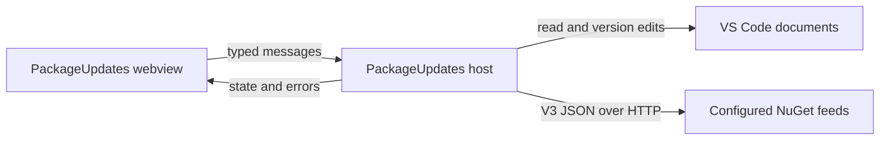

# ADR 0001: Native NuGet update workbench

Status: Superseded before first release by [ADR-0002](ADR-0002-shared-dotnet-engine.md), following the user's requirement for one engine exposed through VS Code and a NuGet global tool. The original TypeScript prototype passed its focused tests; it is not the final delivery architecture.

Use a VS Code webview for the workbench and the extension host for discovery, feed requests, review and WorkspaceEdit. The console PR is inspiration for behavior; implementation is original TypeScript. Avoid shipping its private code.

Alternatives: a .NET sidecar would introduce SDK provisioning and subprocess complexity; CLI-only editing would obscure a multi-file review and conflict detection. Exact text ranges preserve source formatting. XML validity is checked with saxes, and NuGet version precedence is implemented locally with focused tests.

Safety contracts: read actual editor buffers, record full snapshots at discovery and review, reject stale plans, validate all documents together before one WorkspaceEdit, require trust, save only affected documents, report save failures distinctly. Never let the webview supply arbitrary file paths, URLs or unvalidated target versions. CSP permits only packaged scripts/styles.

NuGet metadata contract: flat-container versions must be cross-checked against listed registration catalog entries. A feed missing required metadata or returning an error is explicitly unsupported/failed; no partial success is presented as a complete check.

Implementation stages and owners: TASK-001 lead moves the slice and implements contracts; TASK-002 worker adds real HTTP/host tests and CI; TASK-003 docs worker describes supported behavior; TASK-004 independent reviewer checks safety. The durable feature contract and testing documentation define required behavior and checks.

Rollout: v0.1 GitHub VSIX for manual installation, backed by CI. No Marketplace publish without a configured publisher credential. Rollback: uninstall the VSIX; editor undo or source-control revert restores applied version changes. No data migration or remote state.

Exceptions: declarative webview templates and the single slice host controller may exceed starter function/type LOC counts; review cohesive state ownership and split if another feature appears. Coverage of browser rendering and host behavior uses actual interaction/host evidence rather than pretending Node unit coverage spans VS Code. Record measured core coverage separately before declaring verification.
