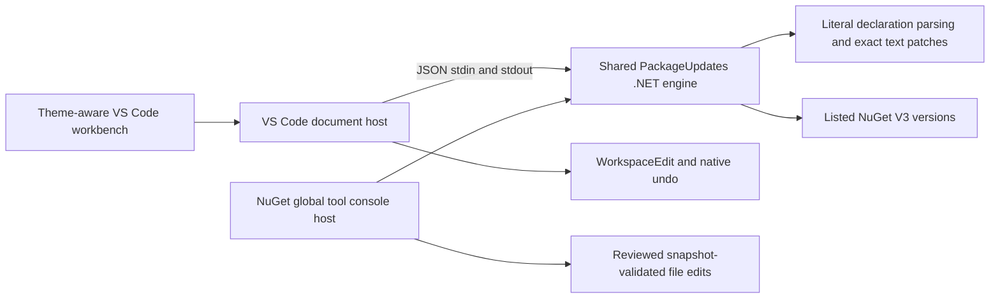

# ADR-0002: Shared .NET engine and two delivery hosts

Status: Accepted and delivered in 0.1.1; local and three-platform hosted verification, GitHub VSIX and public NuGet installation/update passed.
Date: 2026-10-07. Supersedes [0001](0001-native-workbench.md).
Related requirements: REQ-001 through REQ-007; AC-001 through AC-009 in [PackageUpdates](../Features/PackageUpdates.md).

The user requires one implementation exposed through VS Code and an installable NuGet global tool. Use a .NET 10 engine with official NuGet.Versioning semantics, a thin terminal host, and the existing VS Code webview/WorkspaceEdit host. The extension ships a framework-dependent copy of the same tool assembly and requires the .NET 10 runtime. No package installation, hidden credential provisioning or automatic restore occurs during extension activation.

The first-segment grouping from the original idea remains the default. Both hosts offer a whole family in one selection, including narrower dotted prefixes such as Microsoft.Orleans and parent families such as Microsoft. Matching is case-insensitive and requires an exact package ID or a dot boundary, so Microsoft.Orleans never selects Microsoft.OrleansExtra. Grouping does not imply every package has an identical latest version.

The alternative of separate C# and TypeScript implementations violates the requested single code path. A Node process inside a .NET tool adds a second runtime unnecessarily. The chosen engine introduces a subprocess/.NET runtime requirement for VS Code, with a clear startup error and installation guidance. Both hosts keep their own presentation and I/O lifecycle.

Bridge contract: one process per request, invoked as `dotnet <bundled tool.dll> --bridge`; one UTF-8 JSON request on stdin, EOF then one JSON response on stdout. Error response is `{error:string}`, with nonzero process exit. Commands: `parse` ({text} → {declarations,ignored}); `resolve` ({current,versions,policy,prerelease} → {target?,updateKind?,versions}); `apply` ({text,changes} → {text}); `versions` ({packageId,feeds:[{name,url}]} → {versions}). Declaration fields preserve key/packageId/version/start/end/kind/condition and add group. Offsets are UTF-16 to match VS Code. Versions returned by resolve are eligible candidates only. No stdout progress in bridge mode. Cancellation terminates the child; output/request sizes are bounded by the host. Default policy is latest stable. CLI and bridge call the same engine methods; the bridge never writes files.

Ordered implementation contract:

| Task     | Requirements / acceptance                   | Owner and exclusive writes                                                                         | Dependencies and join evidence                                                                                      |
| -------- | ------------------------------------------- | -------------------------------------------------------------------------------------------------- | ------------------------------------------------------------------------------------------------------------------- |
| TASK-005 | REQ-001/002/006/007, AC-001/002/003/008/009 | .NET worker: dotnet/**, NuGetPackageManager.slnx only                                              | Written bridge contract; build, focused engine/CLI tests and local tool install; no publication until name approved |
| TASK-006 | REQ-003/004/006/007, AC-004/005/007/008/009 | Lead: src/**, media/**, scripts/build.mjs, manifests and governance                                | TASK-005 bridge; remove superseded TS implementations; actual host tests and theme/family browser evidence          |
| TASK-007 | REQ-005/006, AC-006/008                     | Verification worker: tests/Features/**, scripts/test\*.mjs, scripts/preview.mjs, .github/**        | Bridge engine exists; migrate HTTP tests to actual bridge, cross-platform CI, pack/install smoke and releases       |
| TASK-008 | REQ-005/006/007, AC-006/008/009             | Docs worker: README, CHANGELOG, CONTRIBUTING, docs/Development, docs/Testing, docs/Operations only | Document this decision and final approved tool name; no publication claim before verification                       |
| TASK-009 | all                                         | Independent read-only final review, lead joins fixes                                               | All workers explicitly complete; inspect every diff and integrated gates                                            |

Lead owns shared contracts and final joins using native collaboration status/wait tools. Workers escalate conflicting ownership, security ambiguity or failing verification. No parallel owner edits a shared file. Root plans/specs are updated before starting workers.

Verification: .NET Release build, engine and CLI regressions, dotnet format verification, npm typecheck/tests/build/format, actual VS Code host suite, dark/light/narrow browser interaction, VSIX package inspection and a packed global-tool install. Check family selection against adjacent prefixes and multi-file stale plans. Release uses tag v0.1.1, produces both VSIX and nupkg, and publishes the NuGet tool using the organization's configured credential. Verify actual NuGet availability and install from the intended feed before calling publication complete. Missing secrets/publisher access is an explicit blocker, never simulated success.

Rollout: the initial release removed the TS engine and shipped the shared .NET engine to both hosts. Runtime and CLI requirements appear in README and actionable errors. Rollback uninstalls either host and reverts reviewed package-file changes. Preserve dirty buffers, BOM, CRLF, conditional declarations and trust restrictions. Declarative UI templates and cohesive host controller may exceed starter LOC limits; split when a second feature introduces separate state ownership. No separate source repository or copied private PR code.
