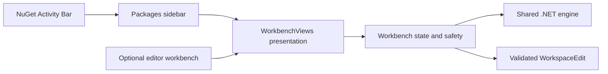

# ADR-0004: Native sidebar and shared workbench state

Status: Accepted. Date: 2026-10-08. Owner: lead. Scope: REQ-008 / AC-010, AC-011, AC-012.

## Context and decision

The installed extension exposes editor commands but no Activity Bar entry. Register a NuGet activity container containing a Packages WebviewView. The open command focuses it; a separate openEditor command presents the wide workbench. Both render the same host-owned state and call the same validated message handler and .NET engine.

WorkbenchViews owns webview initialization, CSP, subscriptions, broadcasts, surface disposal and native diff previews. The controller owns package discovery, policy, review snapshots and writes. A ready/visibility message refreshes only stale discovery; otherwise it emits existing review state. Only closing the last surface cancels outstanding work. Sidebar layout CSS is explicitly scoped to body.surface-sidebar. Product colors use native theme backgrounds/foregrounds and neutral monochrome Managed Code branding after the user rejected orange. High-contrast controls preserve native button tokens. No new network capability or renderer authority is introduced.

## Ordered implementation and ownership

TASK-020 lead defines contracts/manifests and implements the presentation adapter. TASK-021 owns disjoint CSS and usage/architecture docs. TASK-022 owns actual-host regressions with real HTTP data. TASK-023 independently reviews the joined diff. The feature contract and testing documentation define required behavior and checks. Governance and shared contracts remain lead-owned.

## Verification and rollout

TST-SIDE-010 verifies native container activation and discovery. TST-SIDE-011 verifies shared review and surface lifecycle. TST-SIDE-012 verifies narrow theme layouts visually. Preserve existing safety tests; run npm run check, npm run test:host and npm run package, inspect the built VSIX and run independent review. Record concrete results in the plan before declaring implementation verified.

Prepare an installable candidate without overwriting public Marketplace/GitHub 0.1.1. A new public version requires an explicit human release decision. Rollback removes the new container/provider and restores editor-only entry points, leaving shared engine and declaration edits unchanged.

## Consequences and maintainability

One controller avoids conflicting review snapshots between surfaces; a focused presentation adapter reduces the already oversized Workbench file. The existing cohesive controller exception in ADR-0001 remains bounded to edit/discovery coordination (approximately 516 lines, including its single state-machine type). Keep generation, cancellation, review snapshots and edit guards together because splitting them by line count would obscure their atomic safety invariant. Split again when new independent responsibilities appear; presentation and diff-preview ownership have already moved out. Compact sidebar navigation supplements the existing wide editor layout.
