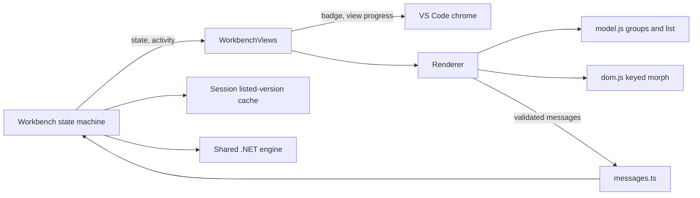

# ADR-0005: Groups-first workbench and automatic checks

Status: Accepted. Date: 2026-10-08. Owner: lead. Scope: REQ-009 to REQ-012 / AC-013 to AC-016 in [PackageUpdates](../Features/PackageUpdates.md). Supplements [ADR-0004](ADR-0004-sidebar-workbench.md); the shared .NET engine and bridge contract in [ADR-0002](ADR-0002-shared-dotnet-engine.md) are unchanged.

## Context

The user rejected the 0.1.2 sidebar after using it on a 168-package workspace: an overlapping review button, a wall of ambiguous family chips, seven stacked filters, red version text from injected webview defaults, a manual check, and a list that jumps to the top on every progress message. A first nested family tree was then rejected by the user as still too complex; they asked for something simple, organized by groups first, with a view switch and a visible option to show preview (prerelease) versions.

## Decision

1. Renderer: classic scripts `dom.js` (escaping, icons, keyed DOM morph), `model.js` (pure view-model, also exported for node tests), `view.js` (templates) and `app.js` (state, events, messages), each loaded with the existing nonce. CSP is unchanged. State messages render once per animation frame and morph into existing nodes, preserving scroll, focus and open controls. No framework, bundler or new runtime dependency.
2. Groups first: families come only from engine-provided `families` chains, so no family matching is reimplemented. A family exists when it holds at least two packages and a prefix with the same packages as its only child folds into it. The default Groups view lists the top-level families with one Update action each and an "Other packages" group for the rest; expanding a group shows its nested families flattened into one-click selection chips (e.g. `Orleans` inside `Microsoft`) and its packages in name order with full IDs (the shared group prefix muted, breaks only at dots). A List view shows the same updates flat. Groups are built from all rows of the view and filters only hide rows inside them, so search never moves a package to another group. Declarations of one package aggregate under one package node and stay individually selectable. Selection remains a set of declaration keys validated by the host.
3. Layout: one responsive layout for both surfaces. Below 780 px a single column whose groups start collapsed and a details drawer; from 780 px a groups column, the open groups and the details stay adjacent. Search, the Groups/List switch and a Prerelease checkbox (as in Visual Studio's NuGet manager) are always visible; version policy, update types, up-to-date packages and package file live in one options panel; status, progress, Stop and the main Update action share the footer. The sidebar has no duplicate refresh button because its title bar offers Check for Updates. The surface class only selects the background and the editor masthead. VS Code's injected `body` padding and `code` colors are neutralized. Interactive controls use native list, input, checkbox, badge, toolbar and validation tokens; the primary button keeps the approved monochrome brand and high contrast keeps native button tokens.
4. Automatic checks: setting `nugetPackageManager.autoCheck` (default `true`). The first visible surface scans and checks; after Apply, and 800 ms after package-file edits while a surface is visible, the host rescans and rechecks. A session cache keeps successful listed versions per package ID for 10 minutes, keyed by the configured feed set. Automatic checks use it; an explicit check or a feed change refetches. Failures and cancellations are never cached, and `checkedAt` reports the oldest feed data used.
5. Native status: `WebviewView.badge` shows distinct packages with updates; `window.withProgress` on the Packages view shows scan/check progress. Title navigation keeps Check for Updates and Open in Editor; Rescan Package Files (formerly Refresh Package Declarations) and a new Configure Package Feeds command move to the overflow menu. The badge keeps its last settled value while the host is busy or an automatic recheck is pending.
6. Host structure: message validation and routing move from `Workbench.ts` to `messages.ts`; the policy and target branches become `setPolicy`/`setTarget` controller methods. `ViewState` gains `activity`, `autoCheck` and `recheckPending`. A scan with a requested check continues straight into the check without publishing an idle state, so selection, group filter, badge and progress survive. New webview messages `rescan`, `openFolder` and `manageTrust` take no arguments; the last two run fixed commands only.

Security: the renderer still has no file or network authority; every selected key, family, version and file is validated against host state. The cache holds public version lists only, in memory, never credentials. Automatic checks also run in Restricted Mode: they only read declarations and query the user's configured feeds, because VS Code ignores workspace-level `nugetPackageManager.feeds` there (restricted configuration); review and apply still require trust.

Alternatives: patching the 0.1.2 layout keeps the defects that cause the problems; a framework or the deprecated webview toolkit adds a bundling and dependency surface for one view; per-edit network rechecks without a cache would hammer feeds; a batched bridge command would cut process start-up (about 70 ms each) but changes the ADR-0002 contract and is deferred until measured need.

## Ordered implementation and ownership

| Task     | Owner and exclusive writes                                                                                                                                                                                                                                                                                            | Dependencies and join evidence                                                                           |
| -------- | --------------------------------------------------------------------------------------------------------------------------------------------------------------------------------------------------------------------------------------------------------------------------------------------------------------------- | -------------------------------------------------------------------------------------------------------- |
| TASK-030 | Lead: governance and spec files, this ADR, `package.json`, `.vscodeignore`, `src/**` (including new `messages.ts`, `events.ts`, `navigation.ts`, `settings.ts`, `versionCache.ts`), `media/Features/PackageUpdates/**`, `scripts/preview.mjs`, `docs/Architecture.md`, `tests/Features/PackageUpdates/groups.test.ts` | Publishes the model API, setting, badge and cache contract; typecheck, build, preview interaction checks |
| TASK-031 | Test worker: `tests/Features/PackageUpdates/model.test.ts`, `versionCache.test.ts` only                                                                                                                                                                                                                               | TASK-030 model API; `npm test` passes against the shipped `model.js`                                     |
| TASK-032 | Host-test worker: `tests/Features/PackageUpdates/host.test.ts`, `scripts/test-host.mjs` only                                                                                                                                                                                                                          | TASK-030 host behavior; `npm run test:host` passes with real HTTP feed request counting                  |
| TASK-033 | Docs worker: `README.md`, `CHANGELOG.md`, `docs/Testing/Testing.md`, `docs/Development/Setup.md` only                                                                                                                                                                                                                 | TASK-030 behavior; `npm run format:check`; no publication claim                                          |
| TASK-034 | Lead: integration, browser and actual VS Code visual evidence, screenshot asset, full gates                                                                                                                                                                                                                           | TASK-031/032/033 complete and inspected                                                                  |
| TASK-035 | Independent read-only reviewer                                                                                                                                                                                                                                                                                        | Joined diff; actionable findings fixed by the lead and gates rerun                                       |

Workers follow the feature contract and this ADR, end complete, blocked, failed or cancelled, and escalate any contract or ownership change to the lead.

## Verification, rollout and rollback

Gates: `npm run check`, `npm run test:host`, `npm run package`, VSIX manifest inspection, renderer model tests, browser interaction checks from 260 to 1600 px and actual VS Code screenshots in Light+, Dark Modern and High Contrast. No version bump: the redesign ships with the next human-approved release; CHANGELOG records it as unreleased. Rollback reverts the renderer, the host routing/cache files and the manifest setting/command; there is no data migration and declaration edits remain plain undoable editor edits.

## Consequences and maintainability

The renderer is split by responsibility so each file stays under 500 lines. `Workbench.ts` keeps generation, cancellation, review snapshots, edit guards and automatic scheduling together under the ADR-0004 cohesive-controller exception (about 545 lines; its 130-line message switch moved to `messages.ts`, event wiring to `events.ts`, navigation to `navigation.ts`, settings to `settings.ts`). Split trigger: move automatic scheduling into its own coordinator when another trigger source is added, or extract policy/target resolution if the controller passes 560 lines. The renderer's IIFE wrappers are module scopes rather than functions; every function inside them stays under 100 lines. Automatic checks spend one bridge start-up per declaration on rescans; revisit a batched bridge command if large workspaces make that visible.
