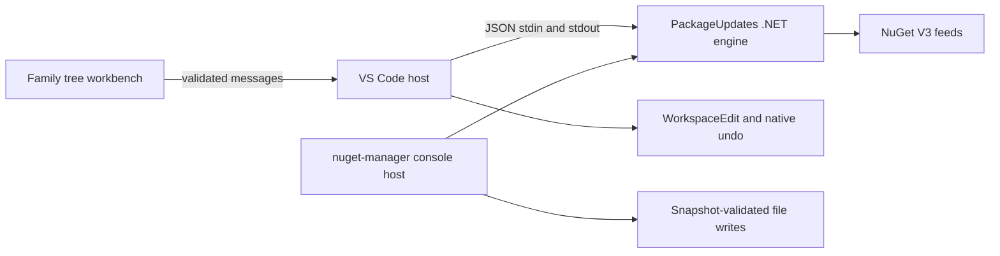

# Architecture

One repository owns NuGet Package Manager for VS Code and the `nuget-manager` global tool. A single .NET 10 PackageUpdates engine parses package declarations and explicit versioned Project child Sdk elements, compares official NuGet versions, checks listed feed metadata, matches package families and validates version-only text patches. Presentation and file I/O belong to each host.

| Surface                                            | Canonical owner                                       |
| -------------------------------------------------- | ----------------------------------------------------- |
| VS Code composition/commands                       | src/extension.ts                                      |
| Shared domain and contracts                        | dotnet/ManagedCode.NuGet.Core/Features/PackageUpdates |
| Console and JSON bridge host                       | dotnet/ManagedCode.NuGet.Tool                         |
| Editor contracts                                   | src/Features/PackageUpdates/Contracts                 |
| Sidebar/editor lifecycle, bridge, document adapter | src/Features/PackageUpdates/Host                      |
| Frontend resources                                 | media/Features/PackageUpdates                         |
| Engine/CLI regressions                             | dotnet/ManagedCode.NuGet.Tests                        |
| Bridge/HTTP and actual editor tests                | tests/Features/PackageUpdates                         |
| Feature truth                                      | docs/Features/PackageUpdates.md                       |
| CI/packaging                                       | .github/workflows and scripts                         |

The native NuGet Activity Bar container hosts a Packages sidebar. Its open command focuses that view; `nugetPackageManager.openEditor` opens the wide editor workbench. Both surfaces share the same controller, discovery results, selected review, validated bridge, and editor writes. Hiding or revealing one surface preserves state, and closing one surface does not cancel work while another remains open. The Activity Bar badge counts packages with updates and the view shows native progress while scanning or checking.

One responsive renderer serves both surfaces: `dom.js` (escaping, icons, keyed DOM morphing), `model.js` (pure groups/list view-model, also tested in Node), `view.js` (templates) and `app.js` (view state, events, messages), each loaded with the page nonce. The default Groups view lists top-level families with one Update action each and nested families as selection chips; a List view shows updates flat. Below 780 px groups start collapsed and details open in a drawer; from 780 px groups, packages and details stay adjacent. `body.surface-editor` only adds the masthead and editor background. Webview messages pass through `messages.ts` validation before reaching the controller.

The VSIX bundles the same framework-dependent engine assembled for the NuGet tool. Users need the .NET 10 runtime and `dotnet` on PATH. The extension never downloads an executable at activation. Bridge requests read supplied text and return data; writes remain in the trusted editor host. VS Code saves previously clean documents and preserves previously dirty buffers. The console validates complete original file snapshots before writing and reports failures.

Families come only from engine-provided dotted prefixes: first-segment families such as `Microsoft` and narrower ones such as `Microsoft.Orleans` appear when they group at least two packages. A family update opens one exact review across every affected file. Feed errors remain explicit. Automatic checks (`nugetPackageManager.autoCheck`, default on) run when a surface opens, after Apply and after package-file edits; they reuse successful listed versions for 10 minutes, while explicit checks always query feeds. The frontend uses VS Code theme tokens with the monochrome Managed Code primary action.

Explicit project SDK support is specified in [ADR-0006](ADR/ADR-0006-explicit-sdk-updates.md). SDKs participate in the same per-dependency family reviews; missing declarations are never inserted.

Read [PackageUpdates](Features/PackageUpdates.md), [ADR-0002](ADR/ADR-0002-shared-dotnet-engine.md), [ADR-0004](ADR/ADR-0004-sidebar-workbench.md), [ADR-0005](ADR/ADR-0005-workbench-redesign.md) for contracts. [ADR 0001](ADR/0001-native-workbench.md) records the superseded prototype. No server, database or separate product repository is required.

Version-driven release and Marketplace publishing are defined in [ADR-0003](ADR/ADR-0003-versioned-publishing.md) and [release operations](Operations/Releasing.md). Successful main CI creates an immutable version tag and explicitly dispatches Release. Marketplace publishing consumes the verified GitHub VSIX through a separately authenticated workflow.
