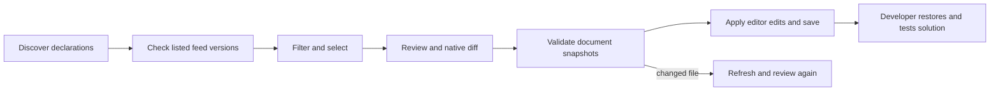

# PackageUpdates

Status: implemented and delivered in 0.1.1; three-platform CI, GitHub VSIX and fresh public NuGet installation/live family update verified. Owner: lead. ADR: [ADR-0002](../ADR/ADR-0002-shared-dotnet-engine.md). Acceptance source: [bootstrap.acceptance.md](../../bootstrap.acceptance.md).

REQ-001 (functional, must): discover literal NuGet declaration ownership. AC-001. Unsupported expressions and invalid XML are visible, never silently editable.
REQ-002 (functional, must): offer numerically newer listed versions within selected update policy. AC-002/003. Stable is default; unlisted metadata cannot be recommended.
REQ-003 (UX, must): choose declarations manually or by family, review exact changes and open native diffs. AC-004/007.
REQ-004 (safety, must): exact document snapshots, trusted workspace, version-only edits, normal VS Code undo. AC-005. A stale plan fails before any edit.
REQ-005 (delivery, must): installable VSIX, tests and cross-platform CI, explicit unsupported features. AC-006.
REQ-006 (contract/delivery, must; user scope expansion): one shared engine for VS Code and a published NuGet global tool with a user-approved simple name. AC-008. Shared parsing/version/feed/edit behavior must have no parallel TypeScript implementation; install the released tool from NuGet to verify delivery.
REQ-007 (functional/UX, must; user's main differentiator): select all updates in a first-segment family or a narrower dotted prefix in one operation. AC-009. Microsoft.Orleans selects its descendants and exact root, never Microsoft.OrleansExtra; every selected declaration appears in the common review.

Slice map: dotnet/ManagedCode.NuGet.Core/Features/PackageUpdates (shared domain), dotnet/ManagedCode.NuGet.Tool (console/bridge host), src/Features/PackageUpdates/{Contracts,Host} (editor adapter), media/Features/PackageUpdates (frontend), tests/Features/PackageUpdates and dotnet/ManagedCode.NuGet.Tests, this document. No backend service or database. Infrastructure is the repository-wide VSIX/NuGet CI/release workflow.

Execution contract: TASK-005 through TASK-009 in ADR-0002 define exact disjoint ownership, dependencies, commands and joins before workers start. REQ-006 maps to AC-008, TASK-005/006/007/008 and engine/CLI/bridge/package tests; REQ-007 maps to AC-009, TASK-005/006/007 and family boundary/host/browser tests. Verification evidence is recorded after integrated checks.

Traceability: REQ-001 → AC-001 → TASK-001/002 → packages.test + host integration; REQ-002 → AC-002/003 → TASK-001/002 → versions.test + actual HTTP tests; REQ-003 → AC-004/007 → TASK-001/002/004 → host and browser evidence; REQ-004 → AC-005 → TASK-001/002/004 → stale snapshot and editor tests; REQ-005 → AC-006 → TASK-002/003 → packaging and CI. Execution ownership/join conditions are defined in bootstrap.plan.md.

Failure behavior: incomplete feed checks remain failed; cancellation leaves unfinished declarations unchecked. Conditional duplicates are separate declarations. Shared central changes affect every consuming project. Property/range/wildcard declarations require manual editing of their owning MSBuild definition. Configured V3 feeds do not claim to implement NuGet.config credentials or source mapping.
