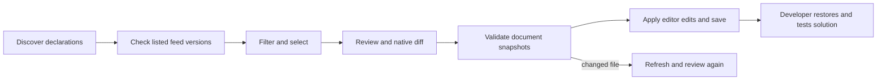

# PackageUpdates

Status: implemented and delivered in 0.1.1; three-platform CI, GitHub VSIX and fresh public NuGet installation/live family update verified. Owner: lead. ADR: [ADR-0002](../ADR/ADR-0002-shared-dotnet-engine.md).

REQ-001 (functional, must): discover literal NuGet declaration ownership. AC-001. Unsupported expressions and invalid XML are visible, never silently editable.
REQ-002 (functional, must): offer numerically newer listed versions within selected update policy. AC-002/003. Stable is default; unlisted metadata cannot be recommended.
REQ-003 (UX, must): choose declarations manually or by family, review exact changes and open native diffs. AC-004/007.
REQ-004 (safety, must): exact document snapshots, trusted workspace, version-only edits, normal VS Code undo. AC-005. A stale plan fails before any edit.
REQ-005 (delivery, must): installable VSIX, tests and cross-platform CI, explicit unsupported features. AC-006.
REQ-006 (contract/delivery, must; user scope expansion): one shared engine for VS Code and a published NuGet global tool with a user-approved simple name. AC-008. Shared parsing/version/feed/edit behavior must have no parallel TypeScript implementation; install the released tool from NuGet to verify delivery.
REQ-007 (functional/UX, must; user's main differentiator): select all updates in a first-segment family or a narrower dotted prefix in one operation. AC-009. Microsoft.Orleans selects its descendants and exact root, never Microsoft.OrleansExtra; every selected declaration appears in the common review.
REQ-008 (UX, must; delivered in 0.1.2): expose a native NuGet Activity Bar icon and working Packages sidebar. AC-010: native activation discovers declarations; AC-011: sidebar/editor surfaces share review and preserve it across visibility/lifecycle changes; AC-012: compact theme-aware sidebar and existing wide editor layout; neutral monochrome branding matching Managed Code, without orange accents. Decision: [ADR-0004](../ADR/ADR-0004-sidebar-workbench.md). Traceability: REQ-008 → AC-010/011/012 → TASK-020/021/022/023 → TST-SIDE-010/011 actual host tests and TST-SIDE-012 visual evidence.

## Workbench redesign (REQ-009 to REQ-012)

Status: implemented for 0.1.3; build and regression checks run in CI. Source: the user's review of the 0.1.2 sidebar on a 168-package workspace and their follow-up steering: simple, groups first, a view switch and a visible prerelease option. Acceptance conditions are defined below. ADR: [ADR-0005](../ADR/ADR-0005-workbench-redesign.md). In scope: renderer, layout, automatic checks, native status. Out of scope: package installation/removal, NuGet.config credentials and source mapping, bridge contract changes.

REQ-009 (UX, must; the user's primary flow): groups first. The default Groups view lists top-level families (engine `families` chains, at least two packages, identical prefixes folded) with one Update action each; packages outside any family share an "Other packages" group; nested families such as `Microsoft.Orleans` are one-click selections inside their group; a List view shows the same updates flat. Package labels keep full IDs (a shared group prefix may be muted); packages and declarations are selectable, partially selected packages are tri-state. Filters hide rows inside stable groups. Pass: AC-013. Fail: an ambiguous suffix-only package label, a 0-count group, a sibling prefix inside a family, or a hidden/filtered declaration included by a group or subgroup action.
REQ-010 (UX, must): check automatically. Opening a surface, applying updates and editing package files while a surface is visible lead to a checked list without a command; `nugetPackageManager.autoCheck` (default true) disables it. Automatic checks may reuse successful listed versions for 10 minutes per feed set; explicit checks refetch. Pass: AC-014. Fail: network access with autoCheck false, cached failures, or a stale cache presented with a newer check time.
REQ-011 (UI, must): simple, compact native layout. Theme tokens in light/dark/high contrast, neutralized injected webview defaults, a visible Groups/List switch and Prerelease option, one options panel (version policy, update types, up-to-date packages, package file) with visible filter chips, status and progress in the footer beside the main action, stable scroll/focus during updates, keyboard navigation, explicit loading/empty/up-to-date/unchecked/failed/restricted/error states, adjacent groups, packages and details from 780 px and a details drawer below. Pass: AC-015. Fail: overlap, horizontal overflow from 260 to 1600 px, version text in preformat colors, or a scroll reset on progress.
REQ-012 (UX, should): native status. Activity Bar badge counts distinct packages with updates; the Packages view shows native progress; title actions are check and open editor, with rescan and feed settings in overflow. Pass: AC-016. Fail: a badge counting failed or unchecked packages.

Edge and failure flows: cancellation leaves remaining packages unchecked and is not cached; feed failures appear in a "Couldn't check" section and never count as current; restricted mode shows the trust banner and disables review/apply; a changed document still rejects the whole plan before edits; an automatic recheck never starts while applying and never discards a valid review it did not invalidate.

| Requirement | Acceptance | ADR      | Task               | Automated test                                               | Evidence                               |
| ----------- | ---------- | -------- | ------------------ | ------------------------------------------------------------ | -------------------------------------- |
| REQ-009     | AC-013     | ADR-0005 | TASK-030, TASK-031 | TST-UI-013 model.test.ts, groups.test.ts; host family review | automated tests and CI                 |
| REQ-010     | AC-014     | ADR-0005 | TASK-030, TASK-032 | TST-UI-014 host.test.ts automatic/cache/badge sections       | automated tests and CI                 |
| REQ-011     | AC-015     | ADR-0005 | TASK-030, TASK-034 | TST-UI-015 browser interaction checks                        | browser checks and VS Code screenshots |
| REQ-012     | AC-016     | ADR-0005 | TASK-030, TASK-032 | TST-UI-016 host badge assertion; manifest inspection         | automated tests and CI                 |

Slice map: dotnet/ManagedCode.NuGet.Core/Features/PackageUpdates (shared domain), dotnet/ManagedCode.NuGet.Tool (console/bridge host), src/Features/PackageUpdates/{Contracts,Host} (editor adapter), media/Features/PackageUpdates (frontend), tests/Features/PackageUpdates and dotnet/ManagedCode.NuGet.Tests, this document. No backend service or database. Infrastructure is the repository-wide VSIX/NuGet CI/release workflow.

Execution contract: TASK-005 through TASK-009 in ADR-0002 define exact disjoint ownership, dependencies, commands and joins before workers start. REQ-006 maps to AC-008, TASK-005/006/007/008 and engine/CLI/bridge/package tests; REQ-007 maps to AC-009, TASK-005/006/007 and family boundary/host/browser tests. Verification evidence is recorded after integrated checks.

Traceability: REQ-001 → AC-001 → TASK-001/002 → packages.test + host integration; REQ-002 → AC-002/003 → TASK-001/002 → versions.test + actual HTTP tests; REQ-003 → AC-004/007 → TASK-001/002/004 → host and browser evidence; REQ-004 → AC-005 → TASK-001/002/004 → stale snapshot and editor tests; REQ-005 → AC-006 → TASK-002/003 → packaging and CI. Execution ownership and checks are defined in the corresponding ADRs and testing documentation.

Failure behavior: incomplete feed checks remain failed; cancellation leaves unfinished declarations unchecked. Conditional duplicates are separate declarations. Shared central changes affect every consuming project. Property/range/wildcard declarations require manual editing of their owning MSBuild definition. Configured V3 feeds do not claim to implement NuGet.config credentials or source mapping.

## Explicit project SDK updates (REQ-013)

Status: implemented and published in 0.1.4; [three-platform CI](https://github.com/managedcode/NuGetPackageManager/actions/runs/37766811366) and [release publication](https://github.com/managedcode/NuGetPackageManager/actions/runs/37767129846) passed. Owner: lead. Decision: [ADR-0006](../ADR/ADR-0006-explicit-sdk-updates.md).

REQ-013 (functional/contract, must; user request): discover literal `<Sdk Name="Aspire.AppHost.Sdk" Version="13.6.0" />` declarations and update them with the `Aspire` package family in VS Code and CLI. SDKs use the same listed-feed lookup, policy, exact review, snapshot validation and version-only edits as package references. SDK identity comes from `Name`; the declaration kind is `Sdk`. Every dependency resolves its own available version; family membership never forces equal versions or asserts cross-package compatibility.

AC-017: a direct child `Sdk` of the root `Project` with literal Name/Version is independently selectable, grouped with its dotted family and updated in the same review as related libraries, including across files. Keep quotes, BOM, CRLF, comments and all other text unchanged; reject stale SDK edits. Conditional duplicates keep separate keys. Expressions, ranges, wildcards and invalid package IDs are reported for manual handling. Versionless SDKs (including Microsoft.NET.Sdk) are left alone and never sent to NuGet. Fake SDKs in comments, CDATA or unrelated/nested XML are not dependencies.

Out of scope: `Project Sdk="Name/version"`, `Import Sdk`, global.json MSBuild SDK versions, SDK MinVersion resolution, .NET runtime/SDK installation and dependency compatibility solving.

Execution contract: TASK-040 lead owns docs, TypeScript declaration contract, bridge/host regression tests and integration. TASK-041 delegated engine worker owns PackageDocuments.cs, a new SdkDeclarationTests.cs and LocalFeedTests.cs only; starts after this spec/ADR, finishes with inspected diff and complete/blocked/failed/cancelled state. TASK-042 independent read-only reviewer joins after both coding scopes complete. Native collaboration status/wait provides joins. Existing project/runtime/feed boundaries stay intact. No temporary planning files are committed; the analysis and ordered plan live in ADR-0006.

| Requirement | Acceptance | ADR      | Task             | Automated test                                                                                                | Evidence                                                                                                                                                                                                          |
| ----------- | ---------- | -------- | ---------------- | ------------------------------------------------------------------------------------------------------------- | ----------------------------------------------------------------------------------------------------------------------------------------------------------------------------------------------------------------- |
| REQ-013     | AC-017     | ADR-0006 | TASK-040/041/042 | SDK parser/edit regressions, CLI local HTTP family update, JSON bridge and real VS Code host SDK review/apply | [CI passed](https://github.com/managedcode/NuGetPackageManager/actions/runs/37766811366); [NuGet and Marketplace publication passed](https://github.com/managedcode/NuGetPackageManager/actions/runs/37767129846) |

## Neutral update search (REQ-014)

REQ-014 (UI, must; user feedback): let users choose All (including prereleases), Stable, Minor (including patch within the current first number), or Patch (within the current first and second numbers). Keep per-package and family selection. Never infer API breakage, features or fixes from version-number changes.

AC-018: Stable remains default; every preset maps to the existing policy/prerelease host contract and triggers a new candidate search. Minor/Patch can be refined with the existing Prerelease checkbox. Numeric update categories remain filters with neutral labels and colors; the overview does not recommend patches over other updates and review does not warn based only on a major-number change. Existing SDK discovery, own-package target resolution and exact edit review remain unchanged.

Plan: TASK-043 lead owns model mapping, message routing, regression assertions, docs, integration and release. TASK-044 delegated renderer worker owns view.js neutral labels and search controls. TASK-045 independent review follows integration. Tests run in CI only; inspect the rendered UI at 1366x768, smaller editor widths and narrow sidebars in both themes before release. No new ADR: existing ADR-0005 renderer/host boundary and numeric engine policies are unchanged. Release authorization: user approved the next patch after completion and verification. Status: implemented; renderer inspected at 1366x768, 1000x650, 900x600 and 320x600 in light/dark themes, including four-mode switching and narrow group review. Fixed active-radio hover contrast during verification. Independent review passed after splitting the regression test to preserve file limits. Build/typecheck passed. [CI passed on all three platforms](https://github.com/managedcode/NuGetPackageManager/actions/runs/37782212228); [0.1.5 GitHub, NuGet and Marketplace publication passed](https://github.com/managedcode/NuGetPackageManager/actions/runs/37782670045).
